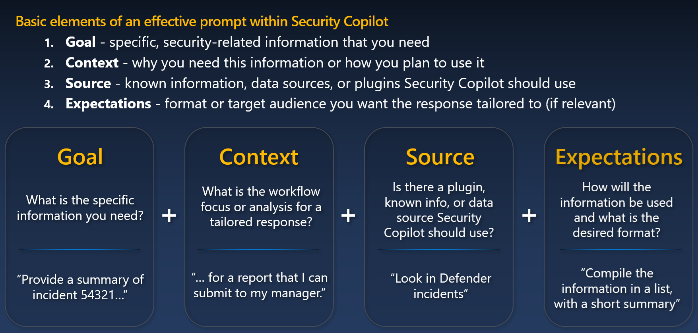

## Module 1 - Basics of Prompt Engineering - Security Copilot

Authors: Rick Kotlarz 
Updated: 2025-April-4

#### ⌛ Estimated time to complete this lab: 15 minutes
#### 🎓 Level: 100 (Beginner)

The following module demonstrates effective prompt engineering for those just getting started with Security Copilot.

1. [How Security Copilot works](#initial-prompt)
2. [Prompting basics](#prompting-basics)
3. [Bad prompting](#bad-prompting)
4. [Good prompting](#good-prompting)

### How Security Copilot works

Regardless of whether you're using the embedded or standalone experience, Security Copilot prompts are evaluated by the Orchestrator. The Orchestrator’s primary role is to interpret the prompt, check enabled plugins, and map values from the prompt to the appropriate fields within one or more skills. As you might expect, prompts that lack sufficient detail often result in poor or incomplete responses or no response at all.

In the embedded experience, prompts are tied to a specific plugin based on the context. For example, if you're in a Purview DLP experience, asking questions about Intune or Defender will likely return no results or incomplete answers.

In contrast, the standalone experience supports all enabled plugins and allows you to pivot freely across plugins and skills. All prompts operate within the security context of your current role. If your role lacks the necessary permissions, prompts requesting that data will not be processed.

It's strongly recommended that you review the following two links before starting these modules.
 - [Prompting in Microsoft Security Copilot](https://learn.microsoft.com/en-us/copilot/security/prompting-security-copilot)
 - [Create effective prompts](https://learn.microsoft.com/en-us/copilot/security/prompting-tips)
 
### Prompting basics

While the order of these elements isn’t critical, including them in your prompts significantly improves the quality of the response.

### Bad prompting

Bad prompts contain vague or highly subjective elements related to **Goal, Context, Source, or Expectation**

| Bad prompt examples | Reasoning why they're bad |
|--------|--------|
| Show me important alerts. | Using the word "important" without clearly defining what it means to you can lead to widely varying results. |
|  How is my security posture from Defender looking today? Show results in a table. | Security posture can refer to many different resources across the Security and Compliance stack. Since there is no single plugin or skill that provides a complete review, asking about overall security posture will result in a response based on incomplete information.
| What's the compliance status of this entity? | Compliance could refer to areas within Intune, Purview, Entra, or other services, making the term too broad without additional context. | 
| Tell me the MFA status for device ASH-U2746 | Devices do not have an MFA status. Asking about this, instead of the MFA status of the user currently or most recently logged in, will result in an inappropriate or failed response. |
| What's the MFA status for that user | Not referring to a named entity by a unique identifier in a prompt will almost always result in errors. It’s best to use a UPN, FQDN, Resource Object ID, or another identifier that is guaranteed to be unique within your organization.|

### Good prompting

Good prompts contain specific elements related to **Goal, Context, Source, and Expectation**

| Good prompt examples |
|--------|
| Using the Defender XDR plugin, provide an SOC manager summary of all Defender incidents over the last 7 days |
| Using NL2KQL for Defender, show me a list of alerts with 'phish' in the title for the last 30 days |
| Using Intune, provide a table showing the last 3 devices that were enrolled and their Operating System |
| Using Entra, what is the MFA enrollment status for user: john.smith@contso.com |
| Using Purview show the last 30 DLP alerts. For each user listed, provide a count of how many times they were included. |
| Using Purview, provide a list of all users that triggered DLP alerts over the last 30 days. For each user, provide their UPN and a count of how many alerts they were associated with. |

--- 

✈️ Continue to [Module 2 - Standardizing Responses with Markdown](.././Module%202%20-%20Standardizing%20Responses%20with%20Markdown)
