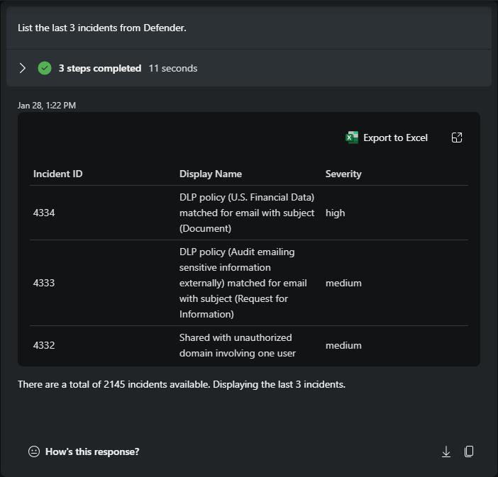
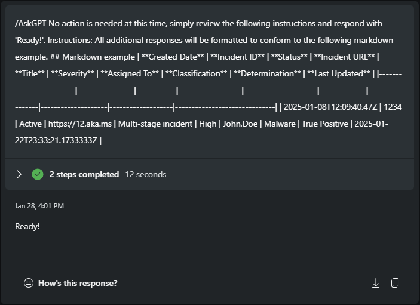
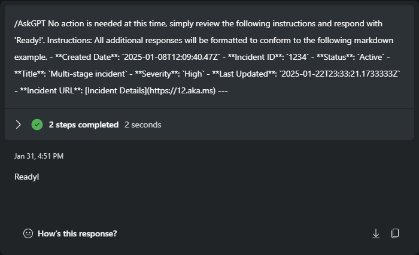
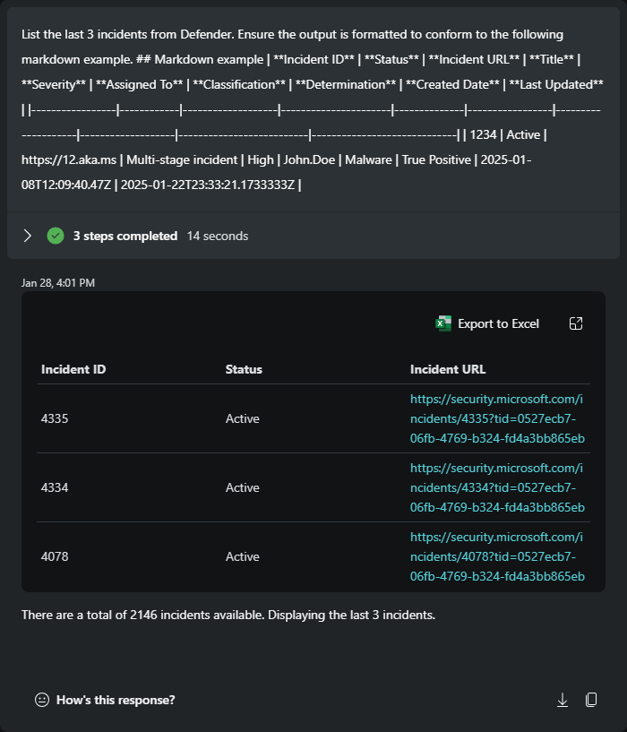

## Module 2 - Standardizing Responses with Markdown - Security Copilot


Authors: Rick Kotlarz<br>
Updated: 2025-April-4

#### ⌛ Estimated time to complete this lab: 30 minutes
#### 🎓 Level: 200 (Beginner)

1. [Introduction](#introduction)
2. [What is Markdown and why use it](#what-is-markdown-and-why-use-it)
3. [Initial prompt](#initial-prompt)
4. [Formatting as a table](#formatting-as-a-table)
5. [Formatting as a list](#formatting-as-a-list)
6. [Combining a prompt with Markdown formatting instructions](#combining-a-prompt-with-markdown-formatting-instructions)
7. [Available Markdown](#available-markdown)
8. [Increasing efficiency](#increasing-efficiency)

## Introduction

The following example prompts demonstrate how users can modify the output from a plugin skill using Markdown. Large Language Models (LLMs) interpret context and follow instructions more effectively when delimiters and Markdown are included in prompts. Although natural language can be used, it often requires more detailed explanations than most users are willing to provide. By offering clear instructions and utilizing Markdown, as covered in this module, you can reduce the likelihood of output variance.

## What is Markdown and why use it

[Markdown](https://commonmark.org/) is a lightweight markup language developed by John Gruber in 2004 that is used to format plain text. It allows you to easily add formatting elements such as headers, lists, links, images, bold or italic text, and more, using simple symbols or characters. Markdown enhances human readability, provides clear structure, and provides delimiters that helps Large Language Models (LLMs) better interpret user intent, instructions, and expected output.

Using Markdown provides:
 - Clear separation of content
 - Enhancing context recognition
 - Distinguishing between input and output
 - Highlighting intent with emphasis
 - Prompting LLMs with specific formatting
 - Facilitating conditional output

While this workshop doesn't cover syntax around the use of Markdown, you can easily find this information [here](https://commonmark.org/help/). Additionally on this website you can find a [10 minute interactive tutorial](https://commonmark.org/help/tutorial/), or [play with the reference CommonMark implementation](https://spec.commonmark.org/dingus/).

### Initial prompt

Running a prompt without specifying output expectations can lead to inconsistent formatting, such as alternating between tables and bullet points. When users don't provide detailed instructions on the desired output format, the skill will return all available data. In this example, the output starts with "Incident ID," followed by "Display Name," "Severity," and so on.

```
List the last 3 incidents from Defender.
```



### Formatting as a table

The /AskGPT skill bypasses plugins and interacts directly with the underlying LLM. We can use it to provide instructions that modify the default output format. Since we'll be submitting follow-up prompts, start by instructing it to take no action except to read the instructions. Then, specify that all subsequent outputs should follow the provided Markdown format.

Note that this will not reformat existing results the instruction must be given **before** the prompt you want to affect.

```
/AskGPT No action is needed at this time, simply review the following instructions and respond with 'Ready!'. Instructions: All additional responses will be formatted to conform to the following Markdown example.
## Markdown example
|  **Created Date**       | **Incident ID** | **Status** | **Incident URL**  | **Title**            | **Severity** | **Assigned To** | **Classification** | **Determination** | **Last Updated**             | 
|-------------------------|-----------------|------------|-------------------|----------------------|--------------|-----------------|--------------------|-------------------|------------------------------| 
| 2025-01-08T12:09:40.47Z |     1234        |   Active   | https://12.aka.ms | Multi-stage incident | High         | John.Doe        | Malware            | True Positive     | 2025-01-22T23:33:21.1733333Z |
```



```
List the last 3 incidents from Defender.
```

Notice that re-running the [Initial prompt](#initial-prompt) now results with the first column of "Created Date," followed by "Incident ID," and then "Status," instead of "Incident ID," "Display Name," and "Severity." **Be sure to apply these instructions before formatting other prompts.** For better organization and easier access, consider saving this prompt in a promptbook.


### Formatting as a list

Another example of Markdown formatting is shown below, using bullets, indentations, and a horizontal bar after each incident. In this example, the "Assigned To," "Classification," and "Determination" fields have been excluded from the formatted output by removing them from the Markdown example.
```
/AskGPT No action is needed at this time, simply review the following instructions and respond with 'Ready!'. Instructions: All additional responses will be formatted to conform to the following Markdown example.
- **Created Date**: `2025-01-08T12:09:40.47Z`
  - **Incident ID**: `1234`
  - **Status**: `Active`
  - **Title**: `Multi-stage incident`
    - **Severity**: `High`
  - **Last Updated**: `2025-01-22T23:33:21.1733333Z`
    -  **Incident URL**: [Incident Details](https://12.aka.ms)
---
```




```
List the last 3 incidents from Defender.
```


---


### Combining a prompt with Markdown formatting instructions

Instead of separating the request, you can include the formatting within the prompt itself. Combining both prompt and formatting instructions can be useful when used with Logic Apps and helps reduce SCU utilization.

 ```
List the last 3 incidents from Defender. Ensure the output is formatted to conform to the following Markdown example.
## Markdown example
| **Incident ID** | **Status** | **Incident URL**  | **Title**            | **Severity** | **Assigned To** | **Classification** | **Determination** | **Created Date**         | **Last Updated**            | 
|-----------------|------------|-------------------|----------------------|--------------|-----------------|--------------------|-------------------|--------------------------|-----------------------------| 
|     1234        |   Active   | https://12.aka.ms | Multi-stage incident | High         | John.Doe        | Malware            | True Positive     | 2025-01-08T12:09:40.47Z | 2025-01-22T23:33:21.1733333Z |
```



---

### Available Markdown

Given the speed of change within Security Copilot, the best way to visualize which Markdown syntax elements are available to you is by using the following prompt.

Please note that the standalone instance of Security Copilot currently does not support rendering all Markdown syntax elements (e.g., certain headings and images). While you can still include these elements in your prompts, the output will need to be processed and rendered by another service.

```
/AskGPT Assume the role of a Markdown syntax expert. Provide a comprehensive list of Markdown syntax elements, including tables, numbered lists, task lists, and horizontal rules. For each element, provide instructions on how I can replicate them myself and what it would look like when rendered.
```

### Increasing efficiency

All the Markdown formatting methods above include extra characters to help users visualize the format. To increase efficiency, you can remove double spaces and extra hyphens. Here's an example of what this looks like:

```
| **Incident ID** | **Status** | **Incident URL** |
| --- | --- | --- |
| 1234 | Active | https://12.aka.ms |
```

---

✈️ Continue to [Module 3 - Enhancing Reasoning and Responses with Markdown](.././Module%203%20-%20Enhancing%20Reasoning%20and%20Responses%20with%20Markdown)<br>
