## Module 4 - Refining Reasoning and Response with Markdown - Security Copilot


Authors: Rick Kotlarz<br>
Updated: 2025-April-4

#### ⌛ Estimated time to complete this lab: 30 minutes
#### 🎓 Level: 300 (Advanced)

1. [Prerequisites](#prerequisites)
2. [Introduction](#introduction)
3. [Mailbox rule KQL query](#mailbox-rule-kql-query)
4. [Converting the KQL query to a plugin](#converting-the-kql-query-to-a-plugin)
5. [Refining reasoning and response](#refining-reasoning-and-response)
6. [creating a promptbook that uses a defined skill](#creating-a-promptbook-that-uses-a-defined-skill)


## Prerequisites

To fully execute all items outlined in this module must have permissions to Microsoft Defender Advanced Hunting pane and the OfficeActivity KQL table.

## Introduction

Large Language Models (LLMs) are highly effective at following instructions; however, humans often omit key details in their prompts, assuming they are understood. This often results in unsatisfactory responses when the model misinterprets the intent incorrectly. To prevent this, you should explicitly include all relevant details, following the prompt engineering best practices covered in the previous module. Doing so enables the model to reason more effectively and respond with greater accuracy and consistency.


### Mailbox rule KQL query

As a SOC analyst, a common task involves investigating mailbox rules, which may be created by legitimate users or, in some cases, by threat actors. One typical method for this investigation is using the Microsoft Defender Advanced Hunting pane to run KQL queries that retrieve detailed information about each rule. In this module, the necessary KQL query for hunting has already been provided. While the query results are helpful, I still need to manually examine each rule's behavior and review the JSON data found in the `Parameters_reformatted` column. This manual process is often time-consuming and prone to errors, especially due to the way the JSON is formatted in the output.

KQL query:

```
let TimePeriod = 30d; 
OfficeActivity
| where TimeGenerated >= ago(TimePeriod)
| where UserId !contains "NT AUTHORITY\\SYSTEM" 
// The above line excludes 'NT AUTHORITY\SYSTEM' due to the high number of false positives from tooling actions such as eDiscovery. Note that when investigating advanced threat actors you will want to include these records.
| extend EST = datetime_utc_to_local(TimeGenerated, "US/Eastern")
| where Operation in (
    "Add-MailboxPermission", 
    "New-InboxRule", 
    "Set-InboxRule", 
    "Set-Mailbox", 
    "New-TransportRule", 
    "Set-TransportRule", 
    "Add-MailboxFolderPermission", 
    "New-ManagementRoleAssignment"
)
// Operations more commonly used by attackers: "Add-MailboxPermission", "New-InboxRule", "Set-InboxRule"
// Noisy Operations less commonly used by attackers: "Set-Mailbox", "New-TransportRule", "Set-TransportRule"
// Noisy Operations rarely used by attackers: "Add-MailboxPermission", "New-ManagementRoleAssignment"
| extend Parameters_reformated = replace(@"\[|\]", "", tostring(Parameters)) // Remove square brackets from Parameters field to ensure propper JSON formatting
| extend ClientIP_reformated = replace(@"\[|\]", "", tostring(extract("^(.*):.*$", 1, ClientIP))) // Drop everything after the last colon and remove square brackets on IPv6 addresses
| project TimeGenerated, UserId, Operation, Parameters_reformated, ClientIP_reformated
```

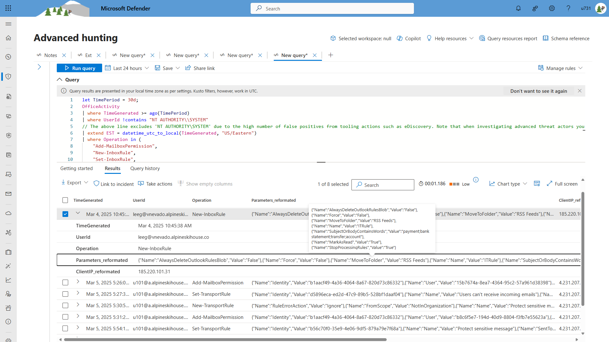

To leverage Security Copilot's ability to reason over the data I can either execute this KQL query from a Logic App and pass the results over to Security Copilot, or simply convert the KQL to a plugin.

### Converting the KQL query to a plugin

Convert KQL queries into a KQL-based plugin is fairly easy. To aid in this process, I reccomend using the [KQL Combined Defender and Sentinel example](https://github.com/Azure/Security-Copilot/blob/main/Plugins/MSFT_Plugin_Samples/KQL/KQL_Combined_Defender_and_Sentinel_Example.yaml) plugin from the plugin samples folder on GitHub. To steamline this part of the workshop I've modified the template to reflect what a plugin would look like. You can either copy and save the following content as `Get_mailbox_rules.yaml` using a plain text editor like Notepad. or simply download an already created version of the plugin [here](./Get_mailbox_rules.yaml)

**Note:** The file extension must be lowercase (`.yaml` or `.yml`). Plugin uploads will fail if the extension is uppercase. If you encounter issues saving the file, wrap the name in double quotes `"Get_mailbox_rules.yaml"` to ensure the correct name and extension. 

```
Descriptor:
  Name: Get mailbox rules
  DisplayName: Get mailbox rules
  Description: This plugin provides a KQL queriy to assist with mailbox rule investigations.
  DescriptionForModel: |
    This query analyzes user mailbox activities within the past 30 days, focusing on potentially malicious mailbox operations which are commonly associated with unauthorized access and attacker behavior. 
    It filters out system-generated events to reduce false positives and helps identify abnormal mailbox permission and rule changes, often indicative of malicious activity.

  SupportedAuthTypes:
    - None

SkillGroups:
  - Format: KQL
    Skills:
      - Name: GetMailboxRulesForAllUsers
        DisplayName: Gets mailbox rules for all users within the last 30 days (GetMailboxRulesForAllUsers)
        Description: Gets mailbox rules for all users within the last 30 days
        DescriptionForModel: |-
          This query analyzes user mailbox activities within the past 30 days, focusing on potentially malicious mailbox operations which are commonly associated with unauthorized access and attacker behavior. It filters out system-generated events to reduce false positives and helps identify abnormal mailbox permission and rule changes, often indicative of malicious activity.
        ExamplePrompts:
          - Get all mailbox rules using over the past 30 days
          - Get all mailbox rules for every user recently
          - Show me all mailbox rules in the last 30 days
          - Show me everyones mailbox rules in the last month
        Settings:
          Target: Defender
          Template: |-
            let TimePeriod = 30d; 
            OfficeActivity
            | where TimeGenerated >= ago(TimePeriod)
            | where UserId !contains "NT AUTHORITY\\SYSTEM" 
            // The above line excludes 'NT AUTHORITY\SYSTEM' due to the high number of false positives from tooling actions such as eDiscovery. Note that when investigating advanced threat actors you will want to include these records.
            | extend EST = datetime_utc_to_local(TimeGenerated, "US/Eastern")
            | where Operation in (
                "Add-MailboxPermission", 
                "New-InboxRule", 
                "Set-InboxRule", 
                "Set-Mailbox", 
                "New-TransportRule", 
                "Set-TransportRule", 
                "Add-MailboxFolderPermission", 
                "New-ManagementRoleAssignment"
            )
            // Operations more commonly used by attackers: "Add-MailboxPermission", "New-InboxRule", "Set-InboxRule"
            // Noisy Operations less commonly used by attackers: "Set-Mailbox", "New-TransportRule", "Set-TransportRule"
            // Noisy Operations rarely used by attackers: "Add-MailboxPermission", "New-ManagementRoleAssignment"
            | extend Parameters_reformated = replace(@"\[|\]", "", tostring(Parameters)) // Remove square brackets from Parameters field to ensure propper JSON formatting
            | extend ClientIP_reformated = replace(@"\[|\]", "", tostring(extract("^(.*):.*$", 1, ClientIP))) // Drop everything after the last colon and remove square brackets on IPv6 addresses
            | project TimeGenerated, UserId, Operation, Parameters_reformated, ClientIP_reformated
```

To upload the plugin select the `Sources` icon in the prompt bar and scroll down until you see "Custom" with another `Sources` icon. 

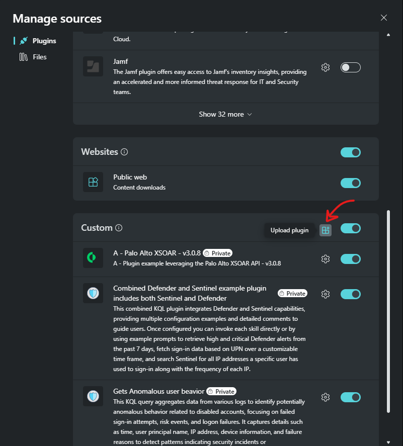

Next, select whether you want to share this plugin with everyone in your organization or just yourself, then select the `Security Copilot plugin` button on the left and uploade the `Get_mailbox_rules.yaml` file. 

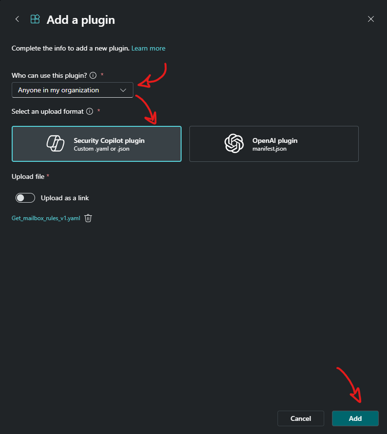

After upload, ensure the plugin is enabled.

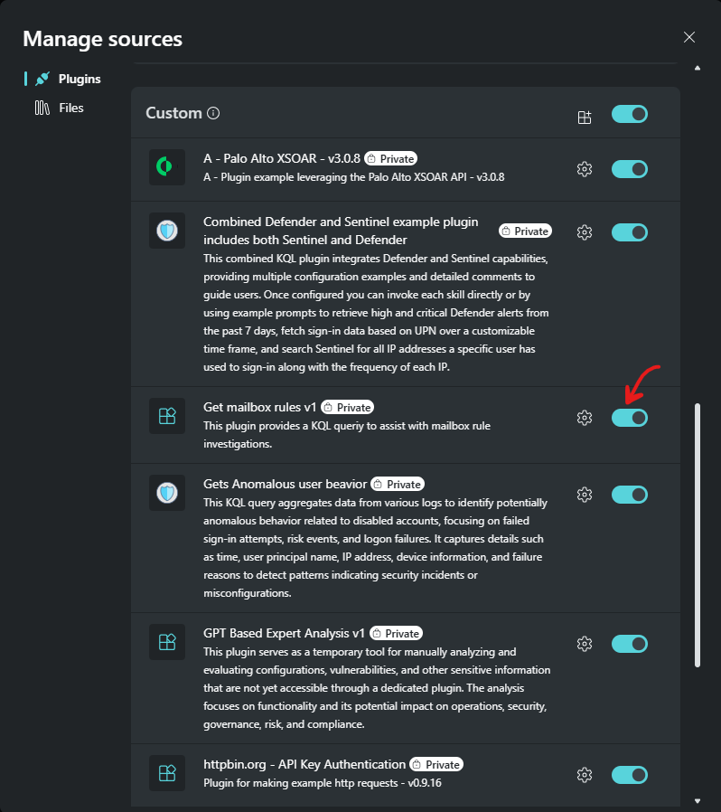

Next search the skills menu for `GetMailboxRulesForAllUsers` and execute

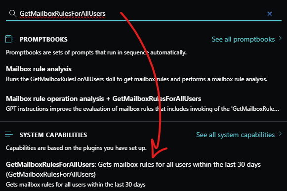

Executing the `GetMailboxRulesForAllUsers` skill results with the same data that I normally see when I run this same query in the Microsoft Defender Advanced Hunting pane.

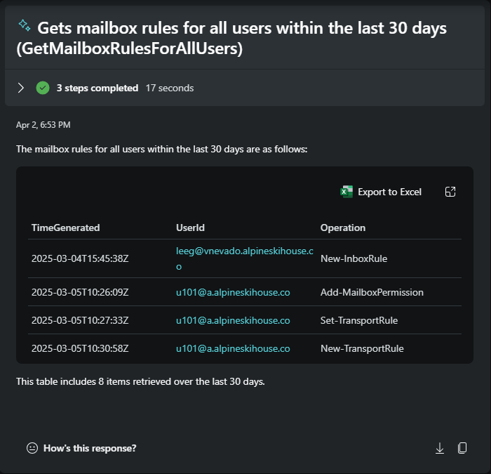

Expanding this window I can see additional rows and columns.

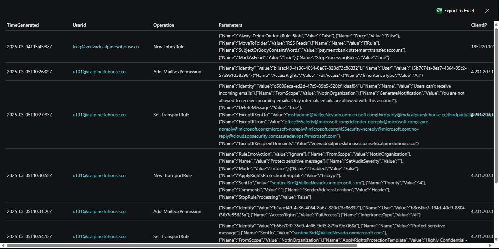


### Refining reasoning and response

I could easily prompt Security Copilot to check for any issues, but the response will likely vary each time. These variations are part of what makes LLM responses feel natural. To ensure the reasoning matches or exceeds human analysis, I need to be specific about my expectations.

To do this, I’ll provide a list of mailbox operations and mailbox rule actions I typically investigate. Essentially, I’m giving the same level of detail I would to a newly hired analyst assigned to analyze mailbox activity and rules. While it's not necessary to include every minor detail, the more context I provide, the better Security Copilot can match my expectations. I’ll also include clear guidance on the exact output format I want.

For human visual review, the prompt is shown below between two horizontal bars. It follows best practices for prompt engineering outlined in the previous module. It includes a defined persona, uses Markdown as delimiters, provides detailed context and instructions, and shows an example of the desired output format.

⚠️ Do not copy the rendered version of the prompt below, as it lacks the Markdown delimiters. Use the version that follows instead.

---
---
/GetMailboxRulesForAllUsers

### Role
Assume the role of an expert SOC Analyst specializing in threat hunting for email and mailbox-based attacks, tasked with analyzing mailbox rule activity for signs of abnormal activity and compromise by reviewing KQL outputs within this session.

### Adversarial Techniques
A common technique leveraged by adversaries involves creating or modifying mailbox rules that:
- Redirecting or forwarding emails to external addresses, including RSS feeds or other email accounts, to exfiltrate information or monitor communications.
- Modifying or deleting evidence of credential changes, configuration updates, or security alerts to avoid detection.
- Flagging emails with specific keywords or from security-related senders for deletion or moving them to hidden folders, such as password resets or MFA alerts, to suppress detection.
- Creating false filters to categorize malicious emails as safe or important, or modifying subject lines and content to disguise their malicious intent.
- Re-routing emails intended for one user to another internal account to gain unauthorized access.

#### Mailbox Operations and Attacker Logic
**Commonly Used by Attackers:**
- `Add-MailboxPermission`: When `FullAccess` or `SendAs` permissions are indicated.
- `New-InboxRule`: When used to exfiltrate sensitive information, hide malicious activities, or manipulating email flow to suppress alerts or maintain persistence in compromised accounts.
- `Set-InboxRule`: When used to exfiltrate sensitive information, hide malicious activities, or manipulating email flow to suppress alerts or maintain persistence in compromised accounts.
**Less Commonly Used by Attackers:**
- `Set-Mailbox`: Attackers may use this operation to exfiltrate sensitive information, disable security features, modify permissions like 'FullAccess' or 'SendAs', and adjust quota limits to facilitate data exfiltration and avoid detection. Note that this operation can also be legitimately triggered when mailboxes are shared.
- `New-TransportRule` or `Set-TransportRule`: Attackers may create transport rules to intercept or redirect emails across the organization, particularly in multi-user compromises. It's important to note that these rules are also used by Exchange administrators to enforce compliance policies, enhance security, manage email flow, apply organizational communication standards, and ensure the proper handling of sensitive or important information.
**Rarely Used by Attackers:**
- `Add-MailboxFolderPermission`: When `Reviewer` permissions are indicated.
- `New-ManagementRoleAssignment`: May be exploited to assign elevated roles to themselves or the attacker's tools.

#### Mailbox Rule Actions and Attacker Logic
**Commonly Used by Attackers:**
- `RedirectToRecipients` Ensures attackers receive email copies without leaving traces in the original mailbox.
- `PermanentDelete` Used to hide traces by permanently deleting emails.
- `MoveToFolder` Used to hide emails in obscure folders to avoid detection.
- `ForwardAsAttachmentToRecipients` Attackers frequently use this to exfiltrate emails to external addresses.
- `ForwardToRecipients` Allows attackers to send email contents externally for further exploitation.
**Less Commonly Used by Attackers:**
- `StopProcessingRules` Can be used to disable legitimate mailbox rules but not as common as direct exfiltration.
- `Delete` Sometimes used to clean up traces, but the "Deleted Items" folder could still reveal activity.

#### Mailbox Keywords That May Indicate a Potential Compromise
- `.bat`, `.exe`, `.iso`, `.ps1`, `.rar`, `.scr`, `.vbs`, `.zip`, `Account`, `ACH`, `Action Required`, `Admin`, `Agreement`, `alert`, `Attachment`, `Attorney`, `Audit`, `Bank`, `Billing`, `CEO`, `CFO`, `Clinical`, `Compliance`, `Confidential`, `Contract`, `Credentials`, `daemon`, `did you`, `Doc`, `License`, `Employee`, `File`, `Hack`, `Helpdesk`, `HIPAA`, `HR`, `Identification`, `Information`, `Internal`, `Invoice`, `IT`, `Key`, `Legal`, `Litigation`, `Locked`, `Manager`, `Medical`, `Passport`, `Password`, `Patient`, `Payment`, `Payment Confirmation`, `Payroll`, `PDF`, `Phish`, `PIN`, `Proposal`, `Reset`, `Restricted`, `Resume`, `RSS`, `Salary`, `Scam`, `Secret`, `Secure`, `Security`, `SSN`, `suspicious`, `Tax`, `Token`, `Transaction`, `Unusual`, `Urgent`, `Verify`, `Wire`

### Task
You are tasked with analyzing the provided mailbox rule output for potential compromise. Focus on:
1. **Mailbox operations and actions configured** and consider the type of behavior associated with threat actors.
2. **Keywords or patterns** that may represent Indicators of Compromise (IoCs) based on current or evolving threats.

**Deliverables:**
1. **List mailbox rules** for each user, sorted by the `TimeGenerated` field and grouped by the count of mailbox rules. Use a horizontal bar (`---`) between each user and indent each new rule to help readability.
2. **Assess each mailbox rule** to determine if its operations and actions likely indicate compromise.
3. **Provide a risk confidence score** for each action using the following levels: `Low`, `Medium`, `High`, `Critical`.
4. **Explain each confidence score**, citing specific keywords, patterns, or behaviors observed in the data.

### Format For Each User
- **User ID:** [User email address, denoted as UserId]
  - **Rule Number:** [Number of rules denoted as 1 of 1, 1 of 2, etc.]
    - **Date and Time:** [Timestamp from "TimeGenerated" field]
    - **Risk Confidence Level:** [Low/Medium/High/Critical]
    - **Mailbox Rule Summary:** [Summarize the actions being taken within the "Parameters_reformated" field]
    - **Analysis Reasoning:** [Summary of the entire mailbox rule, including identified patterns, whether the mailbox operations are commonly, less commonly, or rarely used by attackers, and any matched keywords, or anomalous behaviors fields that support the "Risk Confidence Level"]
    - **Client IP:** [IP address, denoted as "ClientIP_reformated"]

--- 
---

While the explanation above is written for human readers, Large Language Models (LLMs) respond more effectively to prompts formatted in Markdown. For convenience, the same prompt is provided below in a Markdown code block and should be copied and pasted into Security Copilot. When executed, it will trigger the `GetMailboxRulesForAllUsers` skill in the `Get mailbox rules` plugin you previously uploaded.

```
/GetMailboxRulesForAllUsers
### Role
Assume the role of an expert SOC Analyst specializing in threat hunting for email and mailbox-based attacks, tasked with analyzing mailbox rule activity for signs of abnormal activity and compromise by reviewing KQL outputs within this session.

### Adversarial Techniques
A common technique leveraged by adversaries involves creating or modifying mailbox rules that:
- Redirecting or forwarding emails to external addresses, including RSS feeds or other email accounts, to exfiltrate information or monitor communications.
- Modifying or deleting evidence of credential changes, configuration updates, or security alerts to avoid detection.
- Flagging emails with specific keywords or from security-related senders for deletion or moving them to hidden folders, such as password resets or MFA alerts, to suppress detection.
- Creating false filters to categorize malicious emails as safe or important, or modifying subject lines and content to disguise their malicious intent.
- Re-routing emails intended for one user to another internal account to gain unauthorized access.

#### Mailbox Operations and Attacker Logic
**Commonly Used by Attackers:**
- `Add-MailboxPermission`: When `FullAccess` or `SendAs` permissions are indicated.
- `New-InboxRule`: When used to exfiltrate sensitive information, hide malicious activities, or manipulating email flow to suppress alerts or maintain persistence in compromised accounts.
- `Set-InboxRule`: When used to exfiltrate sensitive information, hide malicious activities, or manipulating email flow to suppress alerts or maintain persistence in compromised accounts.
**Less Commonly Used by Attackers:**
- `Set-Mailbox`: Attackers may use this operation to exfiltrate sensitive information, disable security features, modify permissions like 'FullAccess' or 'SendAs', and adjust quota limits to facilitate data exfiltration and avoid detection. Note that this operation can also be legitimately triggered when mailboxes are shared.
- `New-TransportRule` or `Set-TransportRule`: Attackers may create transport rules to intercept or redirect emails across the organization, particularly in multi-user compromises. It's important to note that these rules are also used by Exchange administrators to enforce compliance policies, enhance security, manage email flow, apply organizational communication standards, and ensure the proper handling of sensitive or important information.
**Rarely Used by Attackers:**
- `Add-MailboxFolderPermission`: When `Reviewer` permissions are indicated.
- `New-ManagementRoleAssignment`: May be exploited to assign elevated roles to themselves or the attacker's tools.

#### Mailbox Rule Actions and Attacker Logic
**Commonly Used by Attackers:**
- `RedirectToRecipients` Ensures attackers receive email copies without leaving traces in the original mailbox.
- `PermanentDelete` Used to hide traces by permanently deleting emails.
- `MoveToFolder` Used to hide emails in obscure folders to avoid detection.
- `ForwardAsAttachmentToRecipients` Attackers frequently use this to exfiltrate emails to external addresses.
- `ForwardToRecipients` Allows attackers to send email contents externally for further exploitation.
**Less Commonly Used by Attackers:**
- `StopProcessingRules` Can be used to disable legitimate mailbox rules but not as common as direct exfiltration.
- `Delete` Sometimes used to clean up traces, but the "Deleted Items" folder could still reveal activity.

#### Mailbox Keywords That May Indicate a Potential Compromise
- `.bat`, `.exe`, `.iso`, `.ps1`, `.rar`, `.scr`, `.vbs`, `.zip`, `Account`, `ACH`, `Action Required`, `Admin`, `Agreement`, `alert`, `Attachment`, `Attorney`, `Audit`, `Bank`, `Billing`, `CEO`, `CFO`, `Clinical`, `Compliance`, `Confidential`, `Contract`, `Credentials`, `daemon`, `did you`, `Doc`, `License`, `Employee`, `File`, `Hack`, `Helpdesk`, `HIPAA`, `HR`, `Identification`, `Information`, `Internal`, `Invoice`, `IT`, `Key`, `Legal`, `Litigation`, `Locked`, `Manager`, `Medical`, `Passport`, `Password`, `Patient`, `Payment`, `Payment Confirmation`, `Payroll`, `PDF`, `Phish`, `PIN`, `Proposal`, `Reset`, `Restricted`, `Resume`, `RSS`, `Salary`, `Scam`, `Secret`, `Secure`, `Security`, `SSN`, `suspicious`, `Tax`, `Token`, `Transaction`, `Unusual`, `Urgent`, `Verify`, `Wire`

### Task
You are tasked with analyzing the provided mailbox rule output for potential compromise. Focus on:
1. **Mailbox operations and actions configured** and consider the type of behavior associated with threat actors.
2. **Keywords or patterns** that may represent Indicators of Compromise (IoCs) based on current or evolving threats.

**Deliverables:**
1. **List mailbox rules** for each user, sorted by the `TimeGenerated` field and grouped by the count of mailbox rules. Use a horizontal bar (`---`) between each user and indent each new rule to help readability.
2. **Assess each mailbox rule** to determine if its operations and actions likely indicate compromise.
3. **Provide a risk confidence score** for each action using the following levels: `Low`, `Medium`, `High`, `Critical`.
4. **Explain each confidence score**, citing specific keywords, patterns, or behaviors observed in the data.

### Format For Each User
- **User ID:** [User email address, denoted as UserId]
  - **Rule Number:** [Number of rules denoted as 1 of 1, 1 of 2, etc.]
    - **Date and Time:** [Timestamp from "TimeGenerated" field]
    - **Risk Confidence Level:** [Low/Medium/High/Critical]
    - **Mailbox Rule Summary:** [Summarize the actions being taken within the "Parameters_reformated" field]
    - **Analysis Reasoning:** [Summary of the entire mailbox rule, including identified patterns, whether the mailbox operations are commonly, less commonly, or rarely used by attackers, and any matched keywords, or anomalous behaviors fields that support the "Risk Confidence Level"]
    - **Client IP:** [IP address, denoted as "ClientIP_reformated"]
```

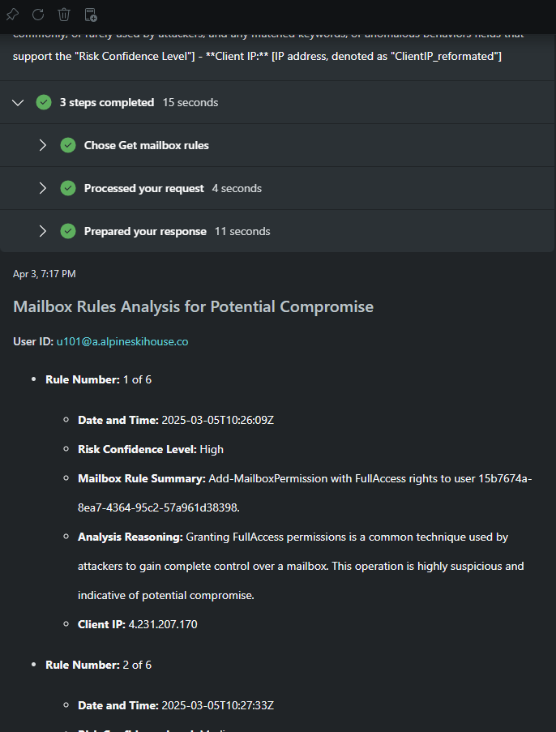

### Creating a promptbook that uses a defined skill

To make this process easily repeatable, I’ll create a Promptbook and ensure the new skill is selected as part of it. As shown in the previous module, I’ll scroll to the top of the last prompt and click the "Create Promptbook" icon.

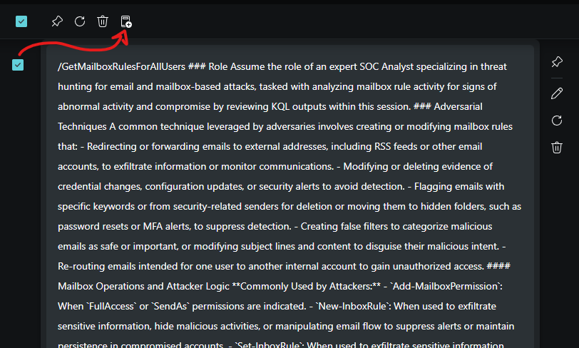

Once the Promptbook window appears, I’ll enter an appropriate name, tags, and description. Notice that the `Plugins` section lists the `Get mailbox rules` plugin that was executed during the execution of this prompt. 

Before saving, I’ll edit the prompt by clicking the pencil icon in the top right corner of the prompt.

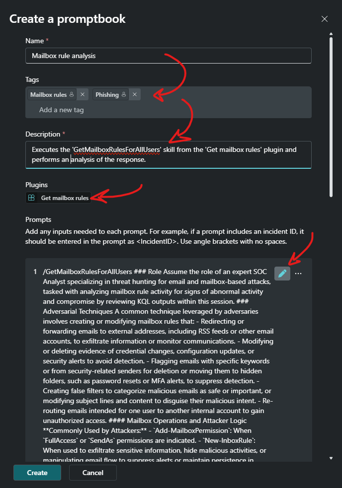

Now I'll copy and remove `/GetMailboxRulesForAllUsers` from the top of this prompt followed by selecting the `Skills` menu icon.

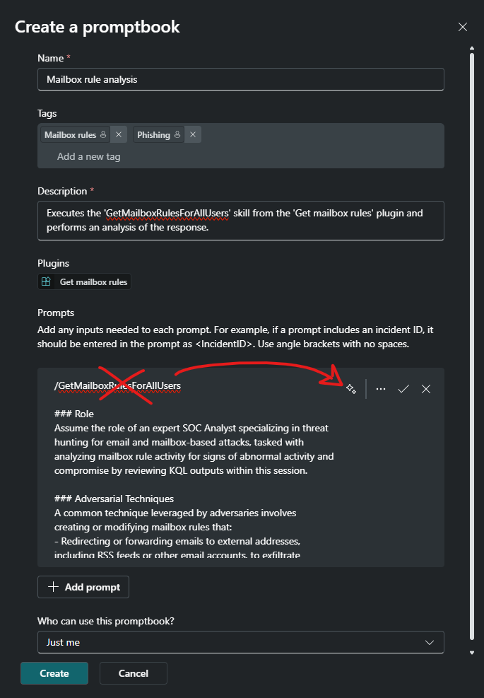

I can either search for the `GetMailboxRulesForAllUsers` skill or simply scroll until until I find it. Once selected, the skill will be added to the Promptbook.

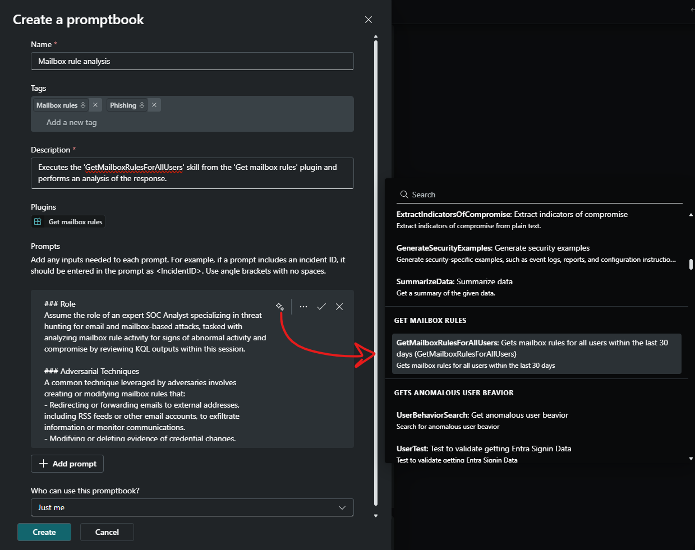

Finally, I’ll click **Create** to save the Promptbook.

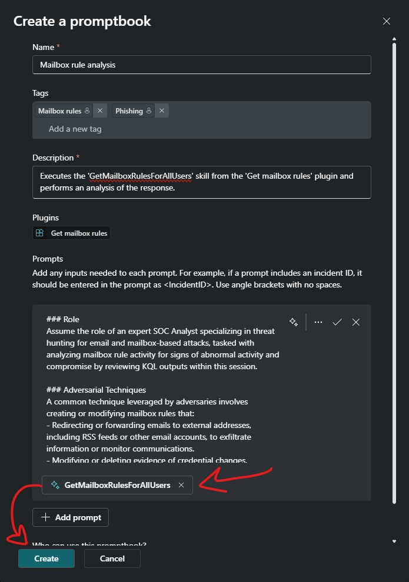

Now I can easily call this Promptbook in the future to execute the KQL within the skill and perform analysis on the returned data.
